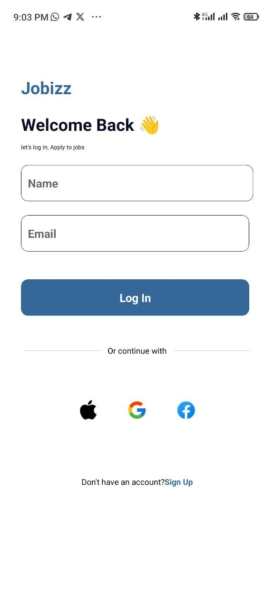

# React Native Task Management App
This React Native application displays task categories and ongoing tasks in a visually appealing layout. The app uses the FlatList component to render horizontal and vertical lists of items.

## Table of Contents
* Installation
* Usage
* Components
* Data

## Installation
1. Clone the repository:
    git clone https://github.com/Charles543/rn-assignment4-11021370

2. Navigate to the project directory:
    cd task-management-app

3. Install the dependencies:
    npm install

4. Start the development server:
    npm start

5. Use the Expo Go app to scan the QR code and view the app on your mobile device.
## Usage

The app has two main sections:

## Main Components and Props
* #### SafeAreaView:
    Ensures the app content is rendered within the safe area boundaries of a device.
* #### View:
    Containers for layout and styling.
* #### FlatList: 
    Efficiently renders large lists and scrollable content.

## Rendering Items

* #### renderItem: 
    Renders each Featured Job card.
* #### renderItem2: 
    Renders each Popular Job card.

## Components
### App Component
The main component of the app. It includes the following sections:

* Username, Email and Profile
* Search bar and filter button
* Horizontal list of Featured Jobs
* Vertical list of Popular Jobs

#### Featured Job Cards
Each category card displays:

* Title
* Location 
* Company
* Salary
* Image

#### Popular Job Cards
Each vertical category card displays:
* Title
* Location 
* Company
* Salary
* Image

## Data Structure
The app uses two arrays to store Featured Jobs data and Popular Jobs data:

### Featured Jobs Data
Stores the information for the horizontal list of Featured Jobs, including:

* id: Unique identifier for the Job
* title: Name of the Job
* Company: Name of the company
* image: Image representing the Company
* Salary: The Jobs Salary 
* Location: The Jobs Location

### Popular Jobs Data
Stores the information for the vertical list of ongoing tasks, including:

* id: Unique identifier for the Job
* title: Name of the Job
* Company: Name of the company
* image: Image representing the Company
* Salary: The Jobs Salary 
* Location: The Jobs Location

## Assets
Make sure you have the following assets in your project directory under `./assets`:

* `amazon.png`
* `apple.png`
* `beats.png`
* `burger-king.png`
* `Ellipse 767.png`
* `Ellipse.png`
* `facebook.png`
* `filter.png`
* `google.png`
* `ibm.png`
* `magnifying.png`
* `microsoft.png`
* `nasa.png`
* `samsung.png`
* `tesla.png`
* `loginScreen.jpg`
* `homeScreen.jpg`

# Project Overview
This project contains two main React Native components: `LoginScreen`  and `HomeScreen`. These components are part of a mobile application designed to facilitate job searches and applications. The `LoginScreen` handles user authentication, while the `HomeScreen` displays job listings to the authenticated user.

# File Descriptions
## `loginScreen.js`

This file contains the implementation of the `LoginScreen` component, which allows users to log in to the application. The key features of this screen include:

* ### Input Fields:
     Two `TextInput` fields for entering the user's name and email.
* ### Login Button:
     A `TouchableOpacity` button that triggers the login process.
* ### Social Media Login Options:
     Options for logging in using social media accounts (Apple, Google, Facebook).
* ### Navigation:
     Directs the user to the `HomeScreen` upon successful login.

##### Key Code Snippets
##### State Management:
Uses React's `useState` to manage name and email inputs.

`const [name, setName] = useState('');
 const [email, setEmail] = useState('');`

##### Login Handler:
Navigates to the `HomeScreen` with user details

`const handleLogin = () => {
navigation.navigate('HomeScreen', {name, email});
}`

# Screenshot

    <h2>Login Screen</h2>
    

## `homeScreen.js`
This file contains the implementation of the `HomeScreen` component, which displays job listings to the user. The key features of this screen include:

* ### User Information Display:
    Shows the logged-in user's name and email.
* ### Search Bar:
    Allows users to search for jobs.
* ### Featured Jobs:
    Displays a horizontal list of featured job cards.
* ### Popular Jobs:
    Displays a vertical list of popular job cards.

##### Key Code Snippets
* ##### User Details from Navigation: 
Retrieves user details passed from `LoginScreen`.

`const {name, email} = route.params;`

* ##### Rendering Job Lists: 
Uses FlatList to render lists of featured and popular jobs.

`
<FlatList
    data={featuredJobs}
    renderItem={renderItem}
    keyExtractor={(item) => item.id.toString()}
    horizontal={true}
    showsHorizontalScrollIndicator={false}
/>
`

# Screenshot

    <h2>Home Screen</h2>
    

## Navigation
The application uses React Navigation for screen transitions. The main navigation occurs from `LoginScreen` to `HomeScreen` upon successful login.

### How to Run
* ##### Install Dependencies: 
    Make sure you have Node.js and React Native CLI installed.
* ##### Clone Repository: 
    Clone the project repository to your local machine.
* ##### Navigate to Project Directory: 
    Open a terminal and navigate to the project directory.
* ##### Install Packages: 
    Run npm install to install all necessary packages.
* ##### Run the App: 
    Use react-native run-android or react-native run-ios to start the application on an emulator or a physical device.

